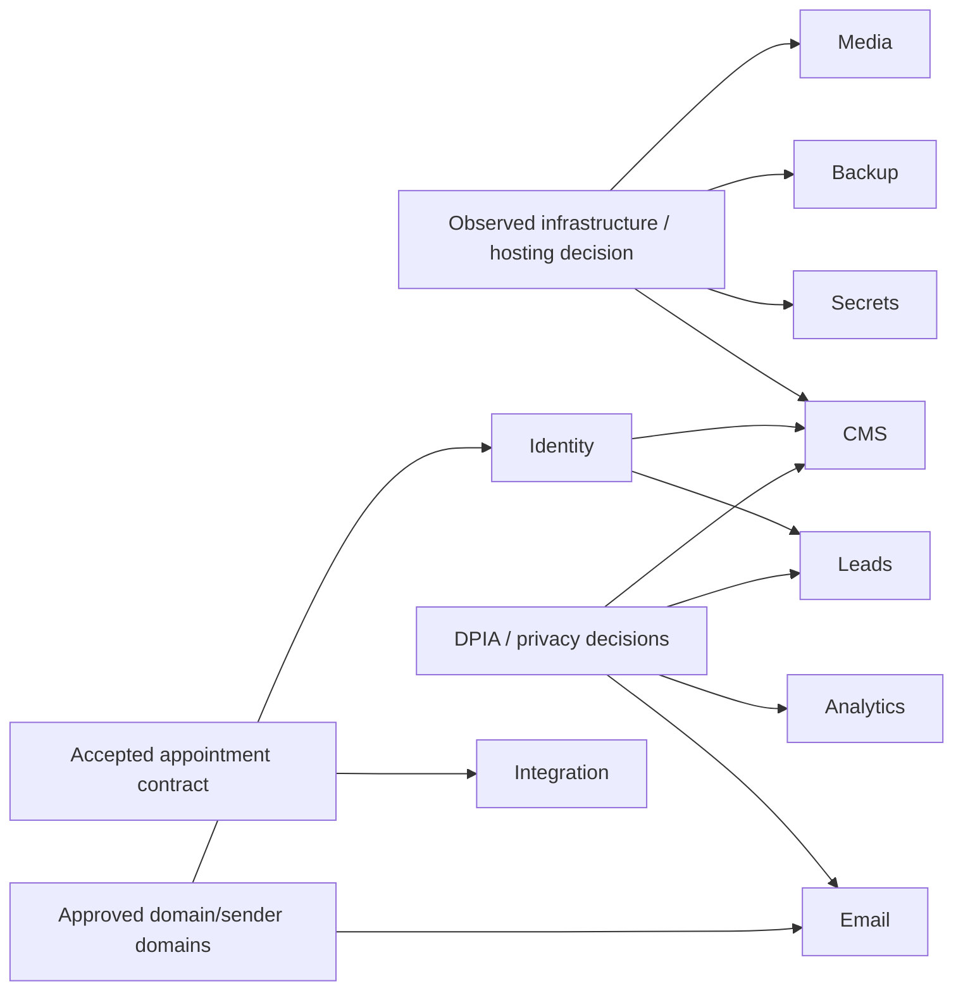

# Architecture Options and Decision Matrix — Phase 0

**Status:** screening analysis only. No option or provider is approved.  
**Evidence constraint:** the public application does not exist, the infrastructure repository is empty, team competence/cost envelopes are unknown, and provider due diligence was not supplied.

## Scoring method

`++` strong fit, `+` favorable, `0` neutral/depends, `-` material drawback, `--` poor fit, `?` insufficient evidence. Scores are reasoned screening assessments, not procurement/legal/security conclusions. “EU” means ability to satisfy the requirement must be verified contractually and operationally; it is never inferred from a product label.

## D-01 Monorepo orchestration

| Option                                    | Security | EU  | Ops        | Cost | Portability | Accessibility | Localization | Lock-in | Team fit | Time-to-safe-release |
| ----------------------------------------- | -------- | --- | ---------- | ---- | ----------- | ------------- | ------------ | ------- | -------- | -------------------- |
| pnpm workspaces + repository scripts only | +        | 0   | +          | ++   | ++          | 0             | 0            | ++      | ?        | ++ initially         |
| pnpm + Turborepo                          | +        | 0   | +          | ++   | +           | 0             | 0            | +       | ?        | +                    |
| pnpm + Nx                                 | +        | 0   | + at scale | +    | +           | 0             | 0            | 0/+     | ?        | 0 for small start    |

**Recommendation for human review:** benchmark scripts-only versus Turborepo against the first real package graph; choose Nx only if its ownership/graph/generator capabilities solve demonstrated needs. The Master Contract's requirement for a monorepo orchestrator can be satisfied after this evidence exists; no dependency is authorized in Phase 0.

## D-02 CMS

| Option                                                                          | Security | EU                        | Ops | Cost | Portability | Accessibility                       | Localization              | Lock-in | Team fit | Time-to-safe-release        |
| ------------------------------------------------------------------------------- | -------- | ------------------------- | --- | ---- | ----------- | ----------------------------------- | ------------------------- | ------- | -------- | --------------------------- |
| Mature self-hosted headless CMS (screening examples: Directus, Strapi, Payload) | 0/+      | depends on hosting        | -/0 | +    | +           | must verify admin + rendered output | must spike FR/NL workflow | +       | ?        | 0                           |
| Mature managed headless CMS with approved EU terms                              | 0/+      | must contractually verify | ++  | -/0  | 0           | must verify                         | must verify               | -/0     | ?        | +                           |
| Git-based content workflow                                                      | +        | depends on Git host       | +   | +    | ++          | editor UX risk                      | catalog support varies    | +       | ?        | - for non-technical editors |
| Custom CMS                                                                      | --       | depends                   | --  | --   | + in theory | high delivery risk                  | high delivery risk        | ++      | ?        | --                          |

**Required spike:** localized slugs/relations, draft-preview-review-publish, rollback, scheduled publication need, media alt text, audit export, webhook/revalidation, role separation, backup/export, admin accessibility, EU residency/DPA/subprocessors, and operational patching. Custom CMS is outside MVP unless the Human Engineering Authority separately approves it.

## D-03 Appointment integration pattern

| Option                                    | Security     | EU  | Ops         | Cost | Portability | Accessibility      | Localization            | Lock-in                 | Team fit | Time-to-safe-release  |
| ----------------------------------------- | ------------ | --- | ----------- | ---- | ----------- | ------------------ | ----------------------- | ----------------------- | -------- | --------------------- |
| Browser calls appointment API directly    | --           | 0   | -           | +    | -           | error UX harder    | mapping leaks to client | -- to external contract | ?        | -- due current gaps   |
| Server-only adapter in Next.js deployable | +            | 0   | ++          | ++   | +           | centralized errors | centralized messages    | +                       | ?        | ++ after contract fix |
| Separate NestJS BFF                       | ++ isolation | 0   | - initially | -    | +           | centralized errors | centralized messages    | +                       | ?        | 0/- initially         |

**Recommendation for human review:** server-only anti-corruption adapter in the initial web deployable, with a separate BFF extraction trigger recorded. All options remain blocked by human-validation, hold-expiry, and OpenAPI defects.

## D-04 Form/lead storage and delivery

| Option                                            | Security | EU                 | Ops             | Cost | Portability | Accessibility | Localization | Lock-in | Team fit | Time-to-safe-release |
| ------------------------------------------------- | -------- | ------------------ | --------------- | ---- | ----------- | ------------- | ------------ | ------- | -------- | -------------------- |
| Email-only submission                             | -        | provider-dependent | + until failure | +    | +           | 0             | +            | 0       | ?        | + but not durable    |
| Portal-owned PostgreSQL records + outbox/delivery | +        | hosting-dependent  | -               | 0/+  | ++          | 0             | +            | +       | ?        | 0                    |
| Managed form/CRM service                          | 0        | must verify        | ++              | -/0  | -           | must verify   | must verify  | --/-    | ?        | +                    |

**Recommendation for human review:** first decide whether leads require durable status, assignment, audit, and retry. If yes, a minimal portal-owned lead store with outbox is the stronger portability/control candidate. If email-only is accepted, explicitly accept loss/retry/audit limitations. No health data may use any generic lead path.

## D-05 Administrator identity

| Option                                           | Security              | EU                 | Ops | Cost              | Portability | Accessibility | Localization  | Lock-in | Team fit | Time-to-safe-release |
| ------------------------------------------------ | --------------------- | ------------------ | --- | ----------------- | ----------- | ------------- | ------------- | ------- | -------- | -------------------- |
| Reuse approved organization IdP                  | ++ if policies mature | must verify        | ++  | ?                 | 0           | must verify   | must verify   | -/0     | ?        | ++                   |
| Managed identity provider with EU-eligible terms | ++                    | must verify        | ++  | -/0               | -           | must verify   | must verify   | -       | ?        | +                    |
| Self-hosted Keycloak-class IdP                   | +                     | hosting-controlled | --  | + license / - ops | +           | must verify   | +             | +       | ?        | -                    |
| CMS-native accounts for CMS only                 | 0/+                   | CMS-dependent      | +   | +                 | -           | CMS-dependent | CMS-dependent | -       | ?        | + for CMS only       |

**Recommendation for human review:** confirm whether an organization IdP already exists. Require MFA, lifecycle/offboarding, role/group mapping, audit, recovery, break-glass, and separation of author/reviewer/publisher. Do not build authentication from scratch.

## D-06 Asset/media storage

| Option                                        | Security | EU                         | Ops | Cost | Portability | Accessibility                             | Localization                | Lock-in | Team fit | Time-to-safe-release |
| --------------------------------------------- | -------- | -------------------------- | --- | ---- | ----------- | ----------------------------------------- | --------------------------- | ------- | -------- | -------------------- |
| Container/local filesystem                    | --       | hosting-dependent          | --  | +    | -           | metadata separate                         | metadata separate           | 0       | ?        | + prototype only     |
| S3-compatible object storage + image pipeline | +        | provider/hosting-dependent | +   | +    | ++          | supports controlled variants/alt metadata | +                           | +       | ?        | +                    |
| Managed media/CDN platform                    | +        | must verify                | ++  | -    | -           | feature verification needed               | feature verification needed | --/-    | ?        | ++                   |

**Recommendation for human review:** prefer an S3-compatible contract or CMS abstraction that preserves exportability. Require malware/type/size controls if uploads exist, immutable originals, derivatives, alt-text workflow, cache invalidation, lifecycle, backup, and EU/subprocessor review.

## D-07 Email delivery

| Option                               | Security | EU                 | Ops | Cost  | Portability | Accessibility                  | Localization | Lock-in | Team fit | Time-to-safe-release |
| ------------------------------------ | -------- | ------------------ | --- | ----- | ----------- | ------------------------------ | ------------ | ------- | -------- | -------------------- |
| Existing approved SMTP relay         | +        | must verify        | ++  | ?     | ++          | template responsibility local  | +            | ++      | ?        | ++ if available      |
| Managed transactional email API/SMTP | +        | must verify        | ++  | 0/-   | + via port  | provider templates must verify | +            | -/0     | ?        | +                    |
| Self-hosted MTA                      | 0        | hosting-controlled | --  | - ops | ++          | local responsibility           | +            | ++      | ?        | --                   |

**Recommendation for human review:** use a provider-neutral delivery port and approved sender domain. Select only after DPA/residency/subprocessors, SPF/DKIM/DMARC ownership, bounce/complaint handling, suppression, retention, accessibility, FR/NL templates, delivery observability, and cost are reviewed.

## D-08 Analytics and consent

| Option                                 | Security/privacy | EU                 | Ops | Cost | Portability | Accessibility                   | Localization       | Lock-in | Team fit | Time-to-safe-release |
| -------------------------------------- | ---------------- | ------------------ | --- | ---- | ----------- | ------------------------------- | ------------------ | ------- | -------- | -------------------- |
| No non-essential analytics at launch   | ++               | ++                 | ++  | ++   | ++          | ++                              | ++                 | ++      | ++       | ++                   |
| Self-hosted privacy-oriented analytics | +                | hosting-controlled | -   | +    | +           | consent decision still required | +                  | +       | ?        | 0                    |
| Managed analytics + consent platform   | 0                | must verify        | +   | -    | -           | CMP accessibility must verify   | FR/NL CMP required | --/-    | ?        | 0/+                  |

**Recommendation for human review:** launch without non-essential analytics unless a measurable product need and lawful consent design are approved. Essential operational telemetry is separate and must remain privacy-preserving.

## D-09 Secrets management

| Option                                      | Security | EU                       | Ops           | Cost | Portability | Accessibility | Localization | Lock-in | Team fit | Time-to-safe-release   |
| ------------------------------------------- | -------- | ------------------------ | ------------- | ---- | ----------- | ------------- | ------------ | ------- | -------- | ---------------------- |
| Plain Kubernetes Secrets populated manually | -        | cluster-dependent        | -             | +    | ++          | 0             | 0            | ++      | ?        | + initially / - safely |
| SOPS/age-encrypted GitOps secrets           | +        | repository/key-dependent | 0             | +    | ++          | 0             | 0            | ++      | ?        | +                      |
| External Secrets + approved secret manager  | ++       | provider-dependent       | + after setup | 0/-  | 0/+         | 0             | 0            | -/0     | ?        | 0                      |
| Sealed Secrets                              | +        | cluster-dependent        | 0             | +    | +           | 0             | 0            | +       | ?        | +                      |

**Recommendation for human review:** align with actual cluster conventions once discovered. Require least privilege, no plaintext Git/CI/image/client values, rotation, audit, break-glass, backup/recovery of keys, and revocation testing.

## D-10 Backup and disaster recovery

| Option                                                       | Security         | EU                | Ops | Cost | Portability | Accessibility | Localization | Lock-in | Team fit | Time-to-safe-release |
| ------------------------------------------------------------ | ---------------- | ----------------- | --- | ---- | ----------- | ------------- | ------------ | ------- | -------- | -------------------- |
| Same-cluster logical dumps                                   | -                | cluster-dependent | 0   | +    | ++          | 0             | 0            | ++      | ?        | + but weak recovery  |
| PostgreSQL operator + pgBackRest/WAL tooling                 | +                | storage-dependent | -   | 0/+  | +           | 0             | 0            | +       | ?        | -/0                  |
| Managed PostgreSQL PITR + cross-region/failure-domain backup | ++ if configured | must verify       | ++  | -    | -/0         | 0             | 0            | -       | ?        | +                    |

**Recommendation for human review:** choose only after data volume, provider/cluster strategy, acceptable RPO/RTO, encryption/key ownership, failure domains, retention, and restore staffing are approved. Same-cluster dumps cannot satisfy production disaster recovery alone.

## Cross-decision dependencies

## Human decisions required before selection

- Team skills and operating model (self-hosted versus managed).
- Budget ranges and procurement lead times.
- EU residency, DPA, subprocessors, transfer, and audit requirements.
- Actual cluster/cloud conventions.
- RPO/RTO and SLOs.
- Content workflow details and editor personas.
- Lead ownership, routing, retention, and administration needs.
- Existing corporate identity/email/media/analytics services.
- Accepted appointment API contract and remediation ownership.
