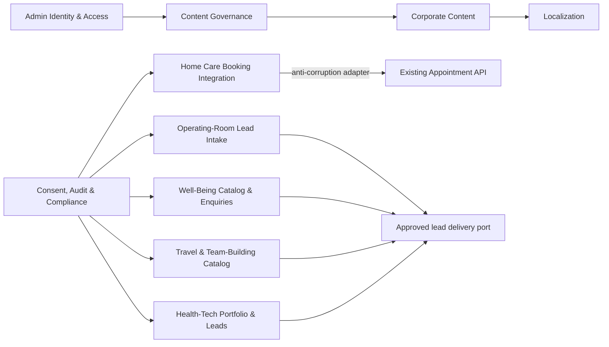

# Bounded-Context Map — Phase 0

**Status:** logical boundaries proposed for a modular application; not a microservice map.

## Context contracts

| Context                        | Purpose and owned concepts                                                                         | Inputs/outputs                                                         | Data owner                                                                               | Required dependencies            | Prohibited dependencies                                 |
| ------------------------------ | -------------------------------------------------------------------------------------------------- | ---------------------------------------------------------------------- | ---------------------------------------------------------------------------------------- | -------------------------------- | ------------------------------------------------------- |
| Corporate Content              | Corporate pages, five-domain navigation, SEO metadata, legal/safety notices, media references      | Published CMS content to locale routes                                 | Content owners                                                                           | Localization, Content Governance | Appointment/patient records                             |
| Home Care Booking Integration  | Portal booking use cases, accepted external-contract mapping, idempotency, timeout/error semantics | Browser commands to appointment API; normalized acknowledgement/status | Appointment API owns appointment/patient truth; portal owns only transient orchestration | Compliance, appointment adapter  | Generic CMS forms, duplicate patient/appointment tables |
| Operating-Room Lead Intake     | Hospital request and professional expression-of-interest workflows                                 | Validated leads to approved delivery/storage port                      | Named business recipient/controller pending approval                                     | Compliance, localization         | Staffing marketplace, patient health data               |
| Well-Being Catalog & Enquiries | Non-medical catalog and qualified enquiry                                                          | Published catalog plus enquiry lead                                    | Content/operations owners                                                                | Content, lead port, compliance   | Medical diagnosis/treatment claims without approval     |
| Travel & Team-Building Catalog | Trips, events, packages, archives, interest and business enquiries                                 | CMS catalog plus non-payment form submissions                          | Travel/business content owners                                                           | Content, lead port, localization | Payment/invoicing/refund automation in MVP              |
| Health-Tech Portfolio & Leads  | Three offer pillars, case studies, consultation request                                            | CMS content plus business lead                                         | Health-Tech content/sales owners                                                         | Content, lead port               | Unsupported claims of certification/SaaS/SLO maturity   |
| Localization                   | Locale routes, keys, formats, hreflang/canonical mapping, fallback rules                           | FR/NL catalogs and locale-aware presentation                           | FR/NL content owners                                                                     | All public contexts              | Silent FR fallback on NL pages                          |
| Content Governance             | Draft/review/publish/rollback and auditable approval                                               | CMS workflows and publication events                                   | Publisher/reviewer roles                                                                 | Identity, Corporate Content      | Self-approval by same role if separation is required    |
| Admin Identity & Access        | Administrator identity lifecycle, MFA, RBAC, sessions                                              | Authenticated principal and authorization decisions                    | Approved identity operator                                                               | Compliance                       | Patient identities or cross-domain SSO in MVP           |
| Consent, Audit & Compliance    | Consent receipts, purpose/retention policy, audit events, privacy controls                         | Policy decisions and privacy-preserving audit                          | Human privacy/security owners                                                            | All input contexts               | Clinical/legal approval by software alone               |

## Dependency rules

1. UI and transport adapters call application use cases; application code depends on domain abstractions; provider adapters implement ports.
2. Only Home Care Booking Integration may depend on the appointment anti-corruption layer.
3. Generic lead intake must reject or route away health/clinical data; it must never reuse the CMS form engine for appointment data.
4. Content modules may depend on Localization, never the reverse.
5. Compliance policy is consumed through explicit policy/consent/audit ports rather than imported provider SDKs.
6. Provider SDKs, framework objects, and database entities may not enter domain modules.

## Extraction assessment

No context currently meets a proven extraction criterion because the public application does not exist and no scaling/team/release metrics are available. Logical boundaries should be enforced inside a modular monorepo first. The appointment API is already external and remains behind the adapter.
