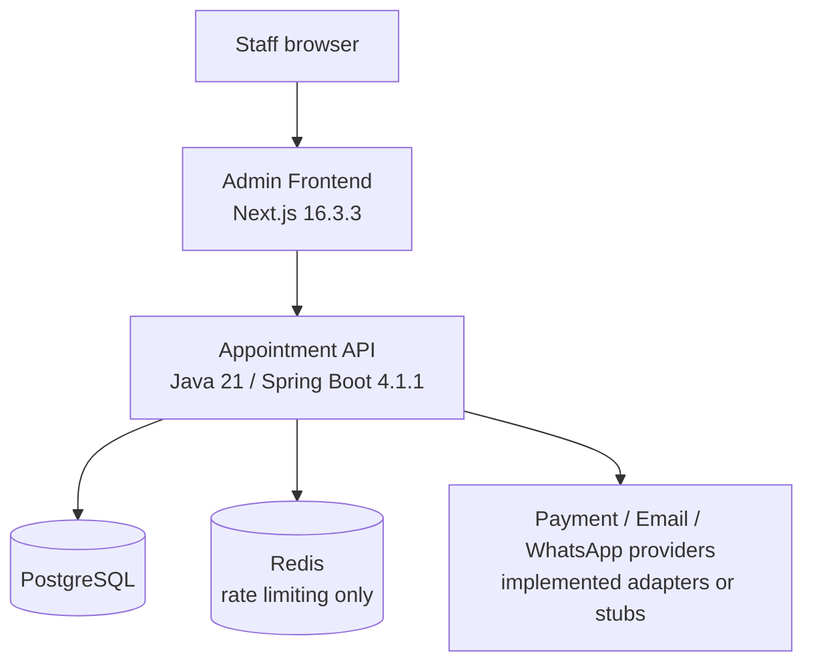
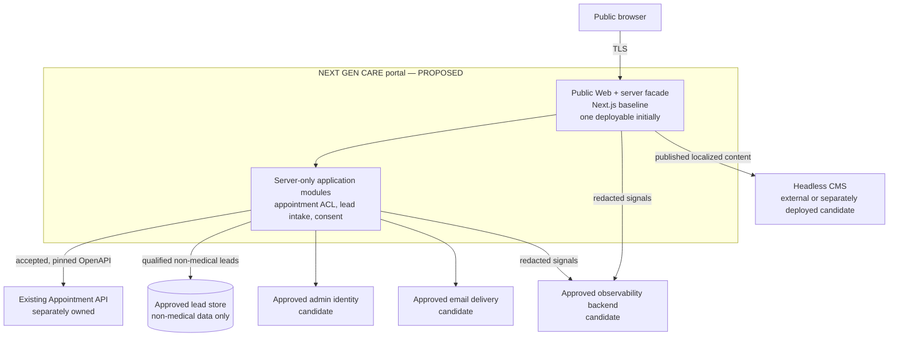

# C4 Container Architecture — Phase 0

**Status:** proposed target; no component in the proposed portal boundary is approved or implemented.

## Current observed containers

Repository evidence does not prove that these containers are running. Plain Kubernetes YAML proposes them; the CI workflows do not deploy.

## Proposed smallest target

### Why no separate BFF container is selected yet

Server-side orchestration is justified: the browser must not call the appointment API directly, external errors need normalization, idempotency/correlation must be controlled, and lead intake needs server-side validation and abuse protection. A separate NestJS deployment is not yet justified by repository scale because the public application does not exist and the same boundary can initially live in server-only Next.js modules. A dedicated BFF remains an ADR option if independent scaling, ownership, availability, or security isolation becomes material.

## Proposed container responsibilities

| Container                  | Responsibility                                                                       | Owner                         | Trust/data boundary                                                  | Existence reason                                                                      |
| -------------------------- | ------------------------------------------------------------------------------------ | ----------------------------- | -------------------------------------------------------------------- | ------------------------------------------------------------------------------------- |
| Public Web + server facade | SSR/static public pages, locale routing, accessible forms, server-side orchestration | Proposed platform team        | Internet-facing; public content plus transient form/booking payloads | One deployable is the smallest architecture capable of enforcing server-side controls |
| Headless CMS               | Localized content, drafts, review/publish, media metadata                            | Content owners + platform ops | Privileged content plane; no patient health data                     | Required product capability; mature product to be selected by ADR                     |
| Lead store/delivery        | Durable or controlled delivery of non-medical qualified forms                        | Domain operations owners      | Personal/business contact data                                       | Needed only after storage/delivery ADR and retention approval                         |
| Existing appointment API   | Scheduling, holds, patient appointment data, cancellation/rescheduling               | Separate appointment owner    | High-sensitivity health scheduling boundary                          | Existing system mandated by contract; must remain separately owned                    |
| Admin identity             | MFA, RBAC, lifecycle for content/lead administrators                                 | Human-approved operator       | Authentication and privileged session boundary                       | Required for strong admin authentication and separation of duties                     |
| Observability backend      | Logs, metrics, traces, alerts                                                        | Platform operations           | Must exclude personal/health payloads                                | Needed for operability; provider/topology pending infrastructure discovery            |

## Scaling and availability

No accepted SLO or traffic model exists. Initial scaling must be evidence-based. Static/public pages should favor build-time or incremental generation; dynamic booking and forms must degrade explicitly when dependencies fail. The appointment API remains authoritative and must not be masked by a portal database copy.

## Extraction triggers

A dedicated BFF, lead service, or other service may be extracted only when an independently measured driver exists: scaling, release cadence, owning team, stricter isolation, availability objective, or demonstrated coupling. Each extraction requires an ADR with data ownership, failure modes, migration, observability, and rollback.
