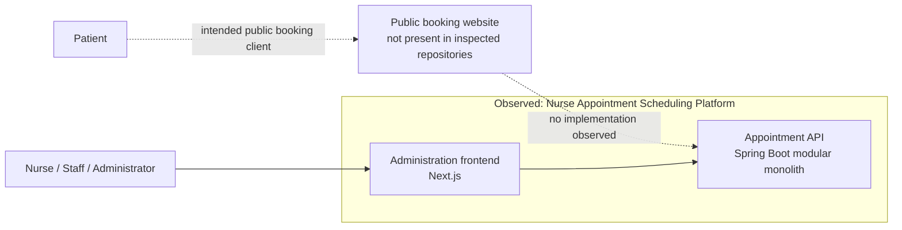
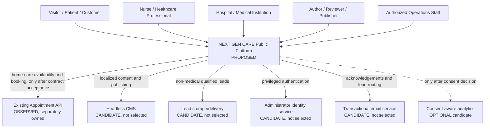

# C4 System Context — Phase 0

**Status:** proposal pending Human Engineering Authority approval  
**Evidence:** `docs/discovery/REPOSITORY_INVENTORY.md` and `docs/discovery/APPOINTMENT_API_INVENTORY.md`

## Current observed context

The NEXT GEN CARE public platform is not implemented in the inspected workspace. The only implemented product is the separately owned appointment platform and its administration frontend.

This diagram does not assert that any component is deployed. It represents repository contents and documented intent only.

## Proposed target context

## Actors and responsibilities

| Actor/system          | Responsibility                                                             | Data boundary                                                                |
| --------------------- | -------------------------------------------------------------------------- | ---------------------------------------------------------------------------- |
| Visitor/patient       | Browse content and, where eligible, submit a home-care appointment request | Public content plus patient/contact/appointment data for the booking journey |
| Professional          | Submit an operating-room expression of interest                            | Professional contact and qualification lead data; no patient data            |
| Institution           | Submit an operating-room service request or team-building enquiry          | Business contact and request data                                            |
| Content team          | Draft, review, approve, and publish FR/NL content                          | CMS identity, content, media, audit data                                     |
| Operations staff      | Review leads and booking outcomes                                          | Least-privilege access to the relevant bounded context                       |
| Appointment API       | Own home-care scheduling, holds, appointments, and patient scheduling data | Special-category/high-sensitivity boundary; portal must not duplicate data   |
| CMS                   | Own public structured content and media only                               | Must not receive medical form data                                           |
| Lead delivery/storage | Own approved non-medical lead records                                      | Retention and recipients require approval                                    |

## Explicit unresolved context decisions

- Approved primary domain and any application subdomains.
- Whether a dedicated portal BFF is a separate deployment or server-only modules inside the web runtime.
- CMS, administrator identity, lead storage/delivery, email, media, analytics/consent, secrets, and backup providers.
- Exact organization/tenant binding and accepted contract for the appointment API.
- Production contact details, sender domains, recipients, service area, service/pricing data, INAMI content, and FR/NL content owners.
