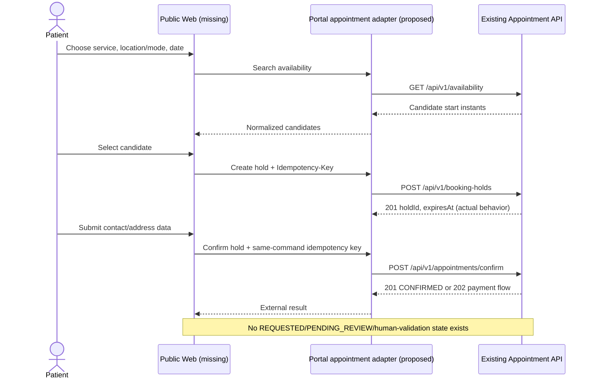
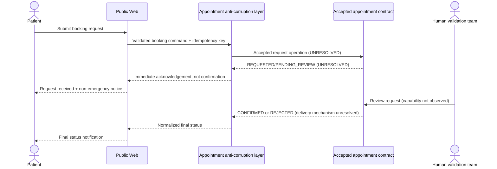
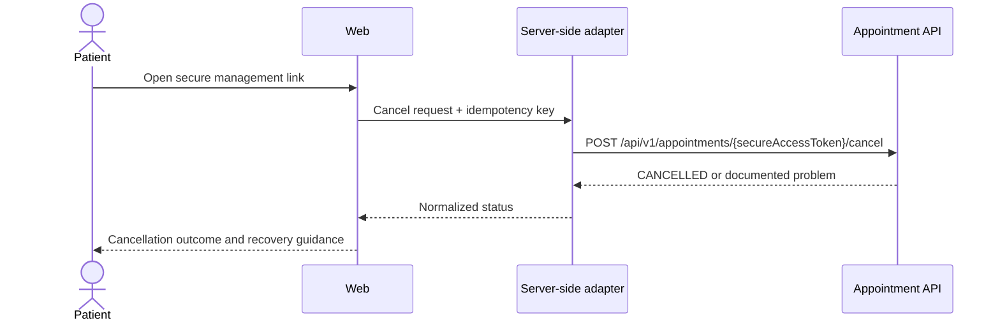
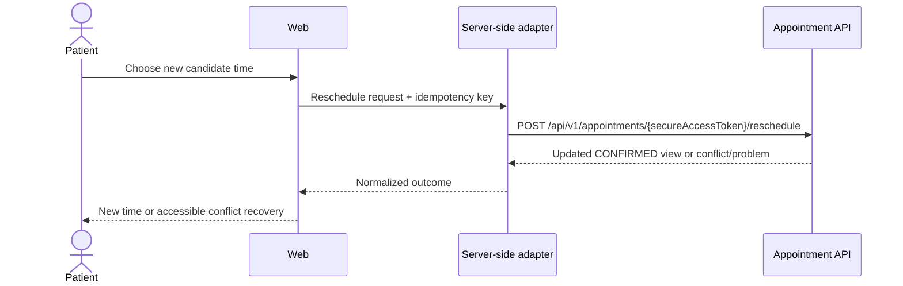
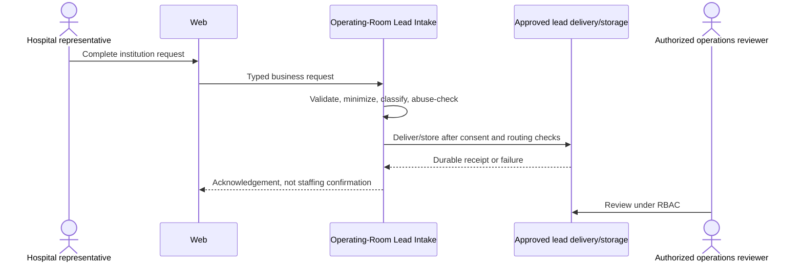
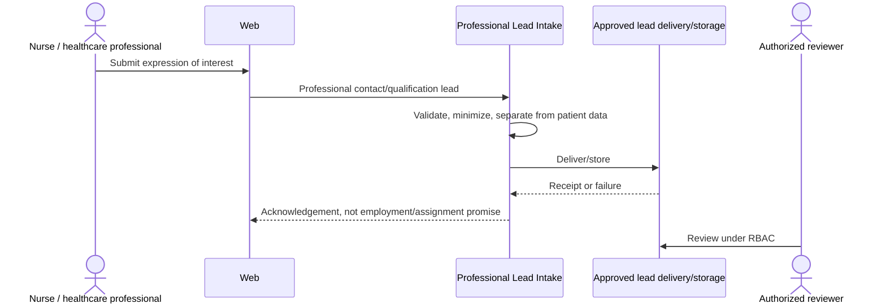
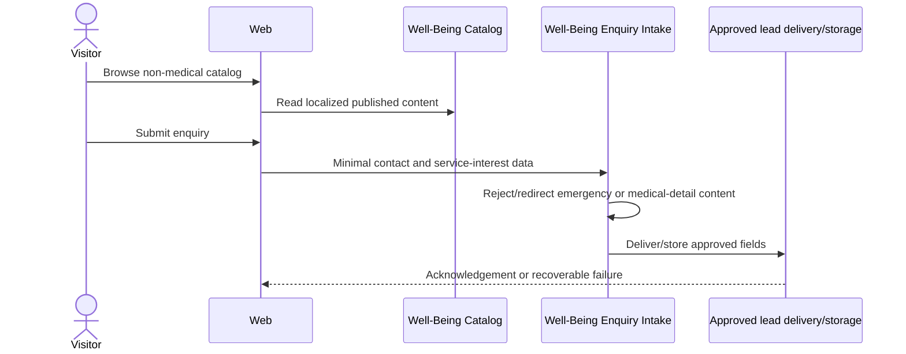
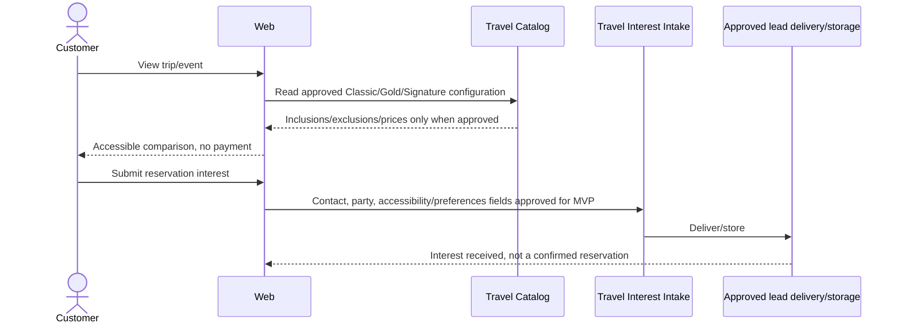
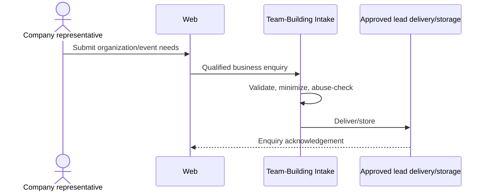

# Critical Journey Sequences — Phase 0

**Status:** proposals and gap analysis. Existing appointment operations are named only where evidenced by source/OpenAPI. Proposed lead flows deliberately use logical commands rather than invented provider APIs.

## Home care: observed booking behavior



This observed behavior is incompatible with the NEXT GEN CARE rule that an immediate acknowledgement is not final confirmation and that final confirmation follows human validation.

## Home care: required human-validation journey



The `UNRESOLVED` operations are requirements, not claims about the existing API. Production booking is blocked until the appointment owner and Human Engineering Authority accept a real contract supporting this lifecycle.

## Home care: duplicate submission and dependency failure

```mermaid
sequenceDiagram
    actor Patient
    participant Web
    participant ACL as Server-side adapter
    participant API as Appointment API

    Patient->>Web: Submit once
    Web->>ACL: Command + client-generated Idempotency-Key
    ACL->>API: Mutation + same key
    alt API returns a definitive response
        API-->>ACL: Success or RFC 9457 error
        ACL-->>Web: Normalized result
    else Timeout / connection lost
        API--xACL: Outcome unknown
        ACL-->>Web: Safe retry message; do not claim failure or success
        Patient->>Web: Retry same logical command
        Web->>ACL: Same body + same key
        ACL->>API: Replay same mutation + same key
        API-->>ACL: Stored response, or documented concurrent-key 409 requiring bounded retry
        ACL-->>Web: One normalized outcome
    end
```

Rules:

- Never generate a new key for an automatic retry of the same logical mutation.
- Never retry a changed body with the same key.
- Do not retry `4xx` business outcomes.
- Use an explicit connection/response timeout; values require performance evidence.
- No unbounded retry or queue may outlive the hold without an explicit user-visible outcome.
- Until the expired-hold defect is fixed, the adapter must treat hold TTL behavior as unreliable and booking go-live remains blocked.

## Home care: cancellation



The capability token must not be copied into portal analytics, application logs, referrers, or infrastructure access logs. Whether the portal can avoid a path token entirely depends on an accepted API contract change.

## Home care: rescheduling



The existing API keeps status `CONFIRMED` during reschedule. Any portal copy referring to `RESCHEDULED` must be presentation/history semantics approved against the accepted contract, not an invented external state.

## Operating-room: hospital request



This is lead intake, not a staffing marketplace or assignment workflow.

## Operating-room: professional expression of interest



## Well-being: qualified enquiry



## Travel: package comparison and reservation interest



No online payment, invoice, deposit, refund, promo-code, or capacity automation is part of this MVP journey.

## Team building: professional enquiry



## Health-Tech: consultation request

```mermaid
sequenceDiagram
    actor Prospect
    participant Web
    participant Portfolio as Health-Tech Portfolio
    participant Intake as Health-Tech Lead Intake
    participant Delivery as Approved lead delivery/storage

    Prospect->>Web: Browse three approved offer pillars
    Web->>Portfolio: Read published claims/case studies
    Prospect->>Web: Submit consultation request
    Web->>Intake: Business contact and problem statement
    Intake->>Intake: Validate; warn against patient/secret submission
    Intake->>Delivery: Deliver/store
    Delivery-->>Web: Acknowledgement, no certification/SLO promise
```

## Cross-journey failure behavior

| Failure                       | User-visible behavior                                                                                                                                  | System rule                                                                             |
| ----------------------------- | ------------------------------------------------------------------------------------------------------------------------------------------------------ | --------------------------------------------------------------------------------------- |
| CMS unavailable               | Serve last safely published/cacheable content when architecture supports it; otherwise a clear temporary-unavailable page                              | Never substitute draft or wrong-locale content                                          |
| Appointment API timeout       | Outcome-unknown message and safe same-key retry path                                                                                                   | Never create a generic lead containing health data as fallback                          |
| Lead delivery failure         | Do not claim successful delivery; preserve only according to the approved durable-delivery design                                                      | No silent email-only loss                                                               |
| Email failure                 | The core request receipt must remain queryable/operable if storage is approved; show on-screen acknowledgement only when the request itself is durable | Email is a notification, not the sole source of truth unless explicitly accepted by ADR |
| Bot/abuse defense unavailable | Fail according to risk-based policy without leaking submitted data to unapproved third parties                                                         | Privacy-preserving controls only                                                        |
| Locale content missing        | Block publication or show explicit unavailable translation behavior                                                                                    | Never silently show French as Dutch                                                     |
