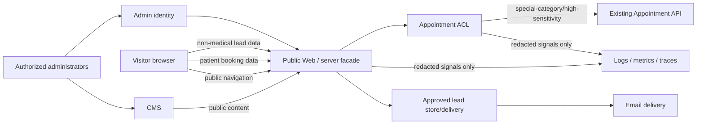

# Data Classification and Flow Map — Phase 0

**Status:** proposed classification requiring qualified privacy/legal acceptance. Lawful-basis entries below are questions/candidates, not legal conclusions.

## Classification levels

| Level                               | Data classes                                  | Examples                                                                           | Baseline handling                                                                               |
| ----------------------------------- | --------------------------------------------- | ---------------------------------------------------------------------------------- | ----------------------------------------------------------------------------------------------- |
| Public                              | Approved published content                    | Pages, service descriptions, approved prices, trips, metadata                      | Integrity, publication audit, accessibility, localization                                       |
| Internal                            | Non-public operational/configuration data     | Draft content, routing rules, feature configuration                                | Authenticated least privilege, audit, backups                                                   |
| Personal                            | Identifiable contact/business lead data       | Name, email, phone, organization, enquiry, accessibility preference where approved | Purpose limitation, minimization, retention, access controls, encryption                        |
| Special-category / high sensitivity | Patient-linked home-care and appointment data | Care service, mode, home address/coordinates, schedule, appointment status         | Appointment boundary only, no CMS/analytics/body logs, DPIA/legal review presumptively required |
| Privileged                          | Identity, authorization, secrets              | Admin identity, roles, sessions, API credentials, cancellation tokens              | MFA, hashing/encryption, rotation, no client/log exposure                                       |
| Audit/telemetry                     | Security and operational evidence             | Publication events, trace IDs, metrics, errors                                     | Immutable/tamper-evident as approved; no personal/health payloads; separate retention           |

## Proposed flow map

## Flow register

| Flow                                 | Classification                                              | Purpose                                     | Lawful-basis question/candidate                                                 | Retention                                    | Access                               | MVP permission                                       |
| ------------------------------------ | ----------------------------------------------------------- | ------------------------------------------- | ------------------------------------------------------------------------------- | -------------------------------------------- | ------------------------------------ | ---------------------------------------------------- |
| CMS to public web                    | Public                                                      | Present approved FR/NL content              | Not normally personal-data processing; confirm media subjects/releases          | Published/revision policy TBD                | Public read; publisher write         | Allowed after governance approval                    |
| Content admin to CMS                 | Personal + privileged + audit                               | Author/review/publish                       | Employment/contract or legitimate-interest candidate; legal review              | Identity and audit schedule TBD              | MFA/RBAC, separation of duties       | Allowed after IdP/CMS ADR                            |
| Browser to appointment adapter       | Special-category/high sensitivity                           | Request home-care appointment               | Article 6 and Article 9 mapping required; consent must not be assumed universal | Must follow accepted appointment policy      | Patient plus minimal server path     | Blocked until DPIA/contract acceptance               |
| Adapter to appointment API           | Special-category/high sensitivity                           | Availability/hold/request/status management | Same approved booking purpose and legal basis                                   | Appointment API owns authoritative retention | Service identity and least privilege | Blocked by contract/semantic defects                 |
| Browser to operating-room lead       | Personal/business                                           | Service request or professional interest    | Pre-contractual/legitimate-interest candidate; review required                  | Per lead type, TBD                           | Named operational role               | Allowed only after fields/routing/retention approval |
| Browser to well-being lead           | Personal; may become sensitive if free text is uncontrolled | Qualified non-medical enquiry               | Pre-contractual/consent candidate; review required                              | TBD                                          | Named operations role                | Free text must be constrained/warned                 |
| Browser to travel/team-building lead | Personal/business; accessibility data may be sensitive      | Reservation interest/enquiry                | Pre-contractual/consent candidate; travel-law review                            | TBD                                          | Travel operations role               | No payment in MVP                                    |
| Browser to Health-Tech lead          | Personal/business; secrets/patient data prohibited          | Consultation request                        | Pre-contractual/legitimate-interest candidate                                   | TBD                                          | Health-Tech commercial role          | Add explicit no-patient/no-secret guidance           |
| Lead system to email provider        | Personal                                                    | Acknowledgement and internal routing        | Same purpose or approved communication basis                                    | Provider logs/retention must be contracted   | Restricted sender/recipient          | Provider and routing decision pending                |
| Web/adapter to telemetry             | Audit/telemetry                                             | Reliability/security evidence               | Legitimate-interest candidate; balancing/transparency review                    | Short, approved operational schedule         | Operations/security                  | Payload/body/token/identifier exclusion required     |
| Web to analytics                     | Online identifiers/consent                                  | Product analytics                           | Consent required when non-essential under approved policy                       | TBD                                          | Aggregated product roles             | Optional; default to none until decision             |

## Data ownership rules

1. The appointment API remains the system of record for patients, holds, appointments, and their lifecycle.
2. The portal must not create a shadow patient/appointment database or persist health request bodies for convenience.
3. The CMS owns content and media metadata only; it must never store patient or medical form submissions.
4. Each qualified form type has its own purpose, field allow-list, recipient role, retention, and audit policy.
5. Free-text fields must carry clear instructions and length limits; workflows with a material chance of receiving health data require a stronger design or removal.
6. Telemetry must use low-cardinality, non-identifying dimensions. Appointment/patient/capability identifiers and form bodies are prohibited unless a specific, reviewed pseudonymization design is approved.

## Privacy gaps requiring human review

- DPIA determination and scope for home-care appointment integration.
- Article 6 lawful basis and Article 9 condition.
- Controller/processor roles and subprocessors for CMS, email, analytics, identity, media, lead storage, hosting, and appointment API.
- EU data-residency and international-transfer constraints.
- Category-specific retention, legal hold, deletion/anonymization, export, rectification, and restriction procedures.
- Cookie/tracking inventory and consent behavior.
- Separation of medical VAT-exempt and taxable commercial activities in content/data/accounting.
- Approved privacy notices and emergency/medical disclaimers in French and Dutch.
