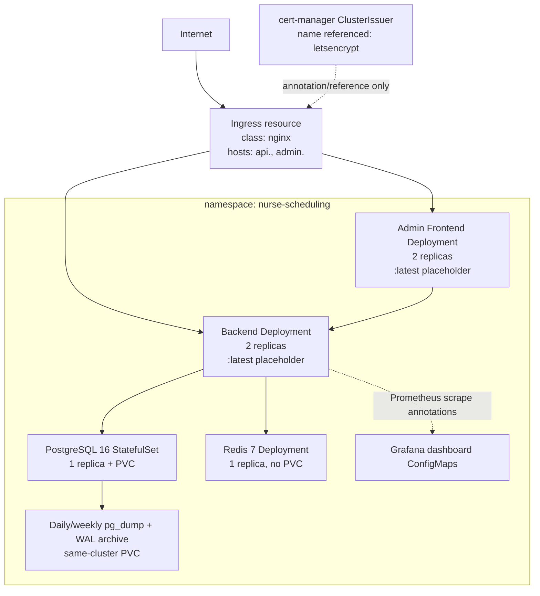
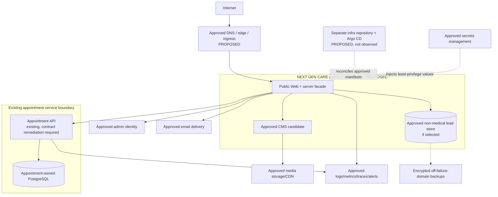

# Deployment and Infrastructure Context — Phase 0

**Status:** observed repository topology plus unapproved target proposal. No cluster state was inspected.

## Observed appointment-repository topology

Evidence is in `nurse-appointment-scheduling-api/k8s`. The manifests are explicitly described there as manual quick-start YAML. They do not prove an NGINX controller, cert-manager, Prometheus, Grafana, Loki, registry, DNS, certificates, secrets, volumes, or workloads actually exist.

## Observed delivery characteristics

| Area            | Evidence                                              | Gap against Master Contract                                                                |
| --------------- | ----------------------------------------------------- | ------------------------------------------------------------------------------------------ |
| Environments    | One namespace/topology; no overlays                   | Development/staging/production not modeled                                                 |
| Packaging       | Plain YAML; no Helm/Kustomize                         | No Helm lint/template path                                                                 |
| GitOps          | No Argo CD definitions                                | Production reconciliation path absent                                                      |
| Image promotion | CI builds only; manifests reference mutable `:latest` | No registry push, digest pin, provenance, promotion, or rollback identity                  |
| Migrations      | Flyway runs on API pod startup                        | Not separately observable; concurrent startup/migration and rollback policy require review |
| Database        | Single self-managed PostgreSQL instance               | No HA; version differs from test/local; encryption/managed backup unproven                 |
| Backups         | Same-cluster dumps/WAL plus runbook                   | Same failure domain; no restore result; effective RPO up to ~24h                           |
| Observability   | Metrics endpoint and dashboard ConfigMaps             | No alert rules, tracing backend, accepted SLOs, or installation evidence                   |
| Secrets         | Kubernetes Secret template, manual creation           | No approved secret manager, rotation, or audit evidence                                    |

## Dedicated infrastructure repository

`/home/hkengne/projects/next-gen-care-infra` is empty and has no Git metadata. Therefore no existing NEXT GEN CARE platform convention can be inferred for Helm, Argo CD, environment overlays, IaC, DNS, certificates, policies, secrets, or backups.

## Proposed target topology

The target intentionally does not name a cloud, hosting, database, storage, identity, email, or analytics provider. It is a boundary proposal only.

## Environment proposal

| Environment | Purpose                              | Data rule                                                                              | Promotion rule                                             |
| ----------- | ------------------------------------ | -------------------------------------------------------------------------------------- | ---------------------------------------------------------- |
| Development | Local/integration development        | Synthetic only; isolated credentials                                                   | Developer/CI builds, no production endpoints               |
| Staging     | Production-representative acceptance | Synthetic or specifically approved anonymized dataset; no real patient data by default | Immutable candidate image and GitOps review                |
| Production  | Public service                       | Approved real data only under accepted privacy/security architecture                   | Explicit Human Engineering Authority release authorization |

Each environment needs separate configuration, secrets, domains, data stores, access, telemetry, and retention. Production images must be promoted by digest; configuration changes must be reviewable and reversible.

## Required infrastructure evidence before implementation/deployment

1. Human-approved repository boundary and creation/repair of a real Git repository.
2. Existing cluster inventory or explicit statement that no cluster conventions exist.
3. Approved namespaces, ingress class, cert issuer, storage classes, network policies, pod-security posture, observability stack, and registry.
4. Approved secrets mechanism and key rotation.
5. Helm/GitOps structure for three environments and Argo CD ownership.
6. Database ownership, migrations, backup topology, RPO/RTO, restore drill, and rollback process.
7. DNS/domain and sender-domain decisions.
8. Capacity/SLO assumptions and cost envelope.

## Deployment stop conditions

No deployment may proceed while the infrastructure repository is empty, providers are unapproved, contracts/privacy are unresolved, or explicit production authority is absent. Phase 0 performed no `kubectl`, `helm`, `argocd`, DNS, certificate, database, registry, or deployment mutation.
