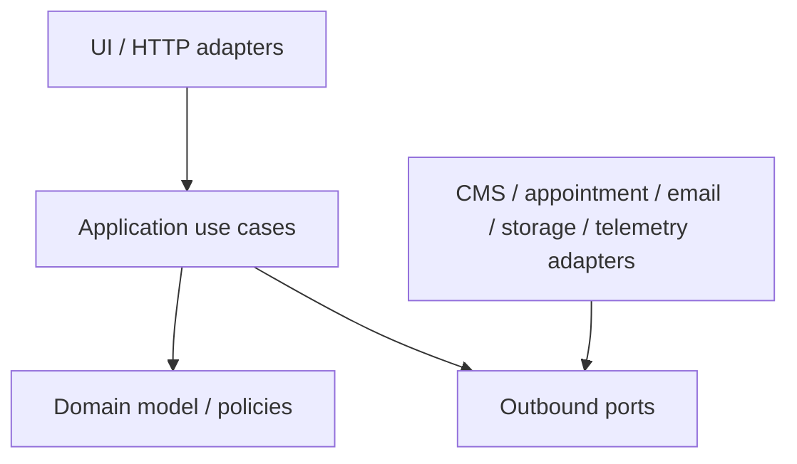

# Target Repository and Module Boundaries — Phase 0

**Status:** proposal only. The current platform repository contains no application code, and no repository move/create operation is authorized in Phase 0.

## Proposed repository responsibilities

```text
next-gen-care-platform/              # proposed application monorepo
  apps/
    web/                             # public Next.js app + initial server facade
    bff/                             # reserved; create only if ADR proves separate deployable need
  packages/
    corporate-content/
    home-care-booking/
    operating-room-leads/
    wellbeing/
    travel-team-building/
    health-tech/
    localization/
    content-governance/
    identity-access/
    consent-audit-compliance/
    appointment-adapter/
    ui/
    config/
    observability/
    testing/
  docs/
    architecture/
    adr/
    api/
    compliance/
    operations/
    reports/
  scripts/
  Taskfile.yml

next-gen-care-infra/                 # proposed separate infrastructure repository
  charts/
  environments/
    development/
    staging/
    production/
  argocd/
  iac/
  policies/
  runbooks/
  Taskfile.yml

nurse-appointment-scheduling-api/    # existing, separately owned; no portal code added here
```

The final physical package granularity should be smaller than the illustrative list where multiple contexts can share a package without violating ownership. Directories must not be created ceremonially.

## Dependency direction



Domain and application modules must not import framework/provider SDKs. Infrastructure adapters depend inward on stable ports.

## Ownership and allowed dependencies

| Module                     | Owns                                                                             | May depend on                       | Must not own/depend on                                         |
| -------------------------- | -------------------------------------------------------------------------------- | ----------------------------------- | -------------------------------------------------------------- |
| `corporate-content`        | Page/navigation/SEO view models                                                  | CMS content port, localization      | CMS SDK types, booking/lead persistence                        |
| `home-care-booking`        | Portal booking commands/status language, idempotency policy                      | Appointment port, compliance policy | Patient/appointment database entities, generic lead form       |
| `appointment-adapter`      | Accepted external DTO mapping, error normalization, timeout/correlation behavior | Generated/pinned client at boundary | UI strings, CMS, direct database access                        |
| Domain lead modules        | Typed field sets, validation, consent/purpose metadata                           | Lead-delivery port, localization    | Shared catch-all form entity, appointment/health fields        |
| `localization`             | Locale identifiers, routing/formatting/fallback policy                           | Translation/catalog ports           | Business-domain persistence                                    |
| `content-governance`       | Publication roles/events/policies                                                | Identity and CMS workflow ports     | Patient/lead data                                              |
| `identity-access`          | Admin principal/authorization abstractions                                       | Approved IdP adapter                | Patient identity, provider-specific token objects in consumers |
| `consent-audit-compliance` | Consent/audit/policy abstractions                                                | Storage/telemetry ports             | Legal conclusions encoded without approval                     |
| `ui`                       | Design tokens and accessible primitives                                          | Localization-neutral props          | Business use cases or provider clients                         |
| `observability`            | Safe instrumentation interfaces                                                  | Approved exporter adapter           | Request bodies, patient/contact identifiers                    |

## API boundary rules

1. Generate a client only from a human-accepted, tracked OpenAPI contract.
2. Keep generated code in an infrastructure boundary and make regeneration deterministic.
3. Map external DTOs/errors/statuses to portal-owned types; do not expose appointment API types to pages/components.
4. Set explicit timeouts and bounded retry policies at the adapter.
5. Preserve idempotency keys for the lifetime of a logical command.
6. Do not log request/response bodies or capability tokens.
7. Add schema/consumer compatibility tests and a breaking-change gate.

## Fitness functions proposed for Phase 1+

- Package import rules enforcing the dependency diagram.
- No provider SDK import outside adapter packages.
- No appointment client import outside `appointment-adapter`.
- No medical/special-category fields in generic lead or CMS schemas.
- No user-facing literal strings outside localization/catalog mechanisms.
- No telemetry call accepting arbitrary objects/bodies.
- Public routes require locale prefixes and tested FR/NL parity.
- Every protected admin operation has a server-side authorization test.

## BFF extraction decision

The initial proposal keeps server orchestration in the web deployable to minimize operational surface. Create `apps/bff` only if an approved ADR establishes one or more material drivers such as separate ownership, independent scaling/release, stricter data isolation, or server workflows that exceed the web runtime's safe operational model.

## Prohibited Phase 1 shortcuts

- Moving or rewriting the appointment repository.
- Copying appointment tables or patient data into the portal.
- Creating one microservice per bounded context.
- Implementing a custom CMS/admin product without an accepted ADR.
- Adding provider-specific configuration before provider approval.
- Treating a green local command as production readiness.
