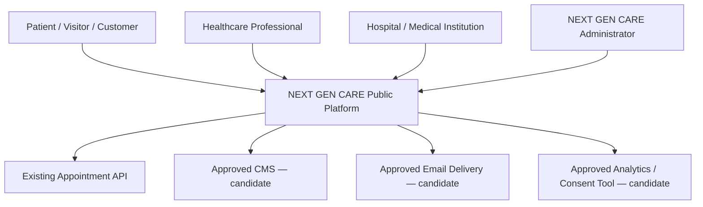
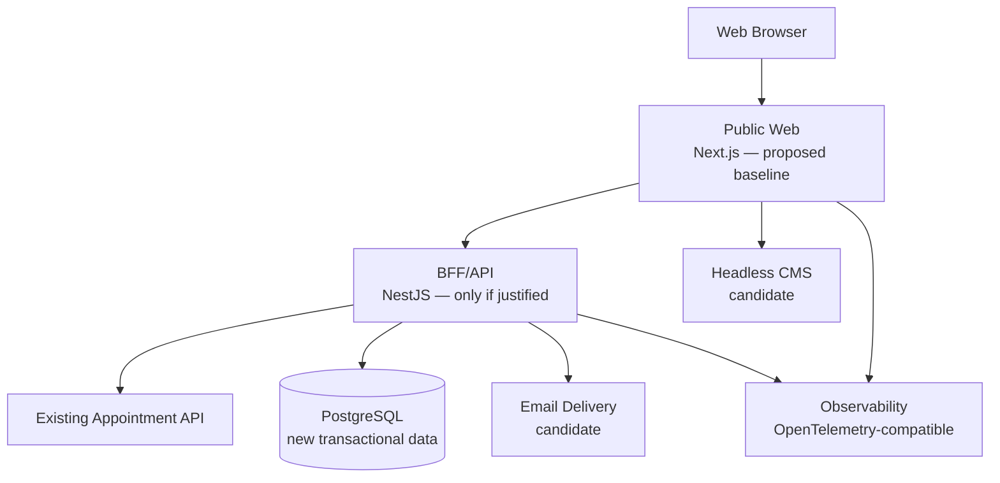
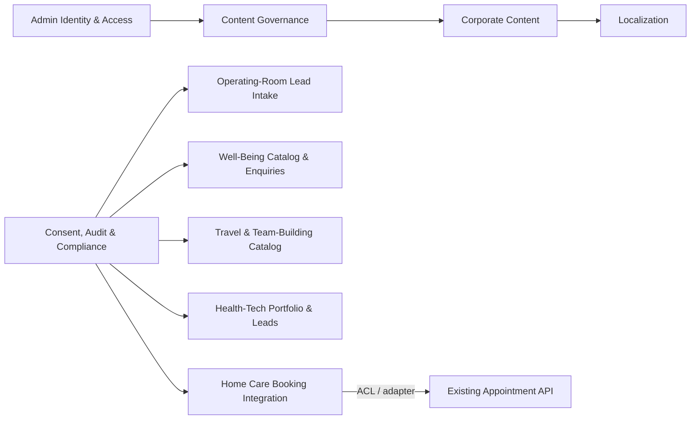
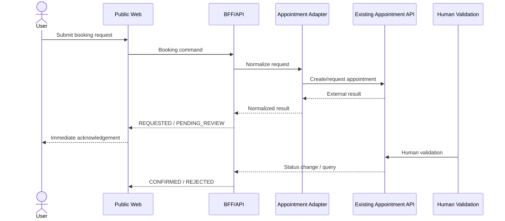
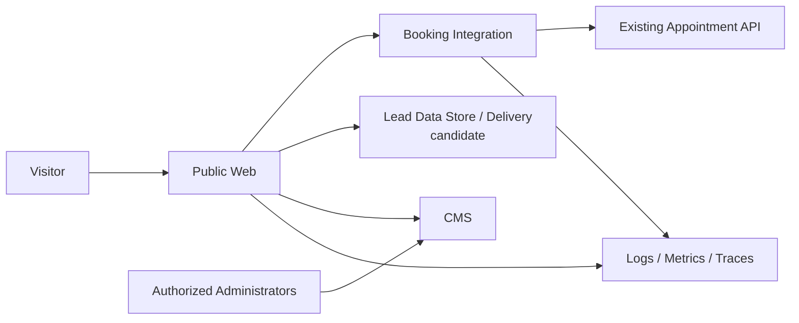
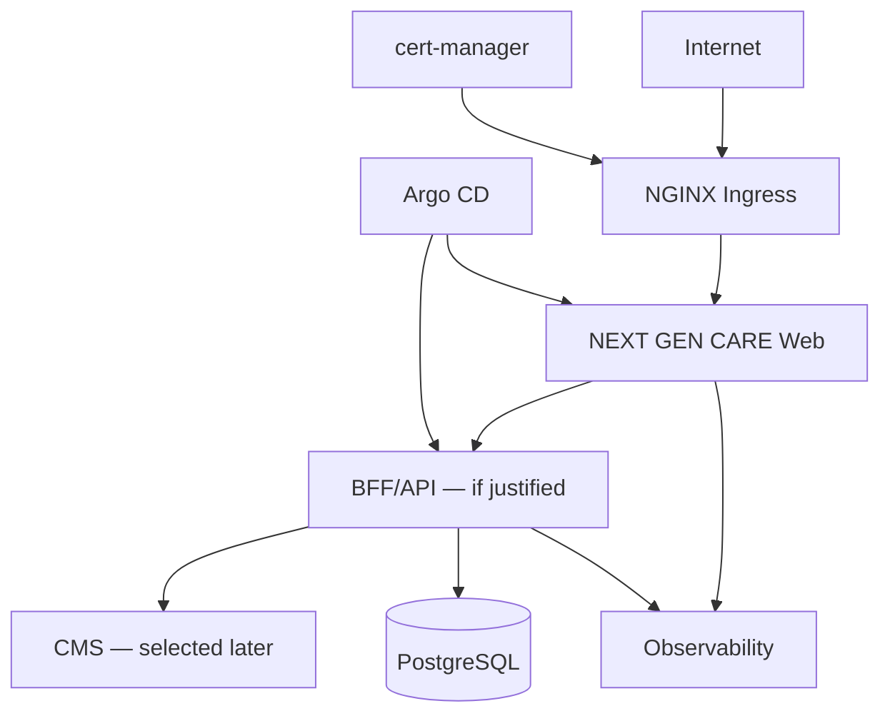

# NEXT GEN CARE — Phase 0 Architecture Schemas

## Purpose

Phase 0 is read-only discovery and architecture.

The objective is to transform repository and infrastructure evidence into a reviewable target architecture proposal without implementing production behavior.

These diagrams are **proposals**, not approved architecture.

Use Mermaid unless a better repository-native diagram format is already established.

---

## 1. C4 System Context

### Required question

Who/what interacts with the NEXT GEN CARE public platform?

### Template



### Rules

- Replace candidate systems with evidence-backed names only when discovered.
- Do not invent external systems.
- Clearly distinguish existing systems from proposed systems.
- Do not claim a provider is selected before the relevant ADR/human decision.

---

## 2. C4 Container Diagram

### Required question

What are the major deployable/runtime containers and their responsibilities?

### Template



### Required annotations

For each container document:

- responsibility;
- owner;
- trust boundary;
- data classification;
- runtime/deployment model;
- dependencies;
- scaling characteristics;
- availability/SLO requirement if evidenced;
- security controls;
- reason it exists.

Do not create a BFF merely because the contract lists NestJS as a baseline. Demonstrate the orchestration/security/integration need.

---

## 3. Bounded Context Map

### Required contexts



### Analysis required

For each context:

- purpose;
- owned concepts;
- input/output contracts;
- data owner;
- dependencies;
- prohibited dependencies;
- future extraction rationale, if any.

Do not turn every bounded context into a microservice.

---

## 4. Home-Care Booking Sequence

### Required states

The contract requires explicit semantics such as:

`REQUESTED → PENDING_REVIEW → CONFIRMED`

and failure/cancellation states including:

`REJECTED`, `CANCELLED`, `RESCHEDULED`

### Template



### Failure paths to model

- duplicate submission;
- timeout;
- retry;
- external API unavailable;
- conflicting booking;
- cancellation;
- rescheduling;
- invalid/expired cancellation token;
- authorization failure.

Do not invent API capabilities. Mark unsupported operations as unresolved.

---

## 5. Form / Lead Intake Sequence

Model separately for:

- hospital request;
- nurse expression of interest;
- well-being enquiry;
- travel reservation interest;
- team-building enquiry;
- Health-Tech consultation request.

Health information must never flow through a generic CMS form.

---

## 6. Data Classification and Flow Map

### Template



### Required classification

Classify at minimum:

- public content;
- contact/lead data;
- health data / special-category data;
- authentication/admin data;
- audit data;
- telemetry;
- media;
- localization content.

For each flow document:

- source;
- destination;
- purpose;
- lawful basis candidate;
- retention;
- access;
- encryption;
- processor/subprocessor considerations;
- whether the flow is allowed in MVP.

Do not state legal conclusions as facts. Label legal/privacy questions requiring qualified review.

---

## 7. Threat Model

Use a lightweight STRIDE-style model for critical journeys.

### Minimum assets

- health data;
- appointment information;
- administrator credentials;
- CMS publishing rights;
- lead data;
- audit records;
- API credentials;
- session/cancellation tokens;
- production secrets.

### Minimum threats

- unauthorized appointment access;
- booking manipulation;
- duplicate booking;
- credential compromise;
- privilege escalation;
- XSS;
- CSRF;
- injection;
- SSRF;
- abuse/spam;
- data leakage in logs;
- insecure file upload;
- CMS publication compromise;
- supply-chain compromise;
- secret leakage;
- dependency compromise;
- API availability failure.

### Template

| Asset        | Threat             | Attack path | Impact | Existing control | Gap    | Proposed control       | Evidence | Owner |
| ------------ | ------------------ | ----------- | ------ | ---------------- | ------ | ---------------------- | -------- | ----- |
| Health data  | Log leakage        | API → logs  | High   | Unknown          | Verify | Redaction policy/tests | TBD      | Human |
| Admin access | Account takeover   | Admin → IdP | High   | Unknown          | Verify | MFA + least privilege  | TBD      | Human |
| Booking      | Duplicate mutation | Retry       | High   | Unknown          | Verify | Idempotency            | TBD      | Human |

---

## 8. Deployment / Infrastructure Context

Phase 0 must inspect the actual Kubernetes/infrastructure repository before drawing the target topology.

### Candidate baseline only



Every actual component must be backed by repository/cluster evidence.

---

## 9. Target Module Boundaries

### Candidate monorepo

```text
apps/
  web/
  bff/

packages/
  domain/
  application/
  ui/
  config/
  observability/
  testing/

docs/
  architecture/
  adr/
  compliance/
  operations/
  reports/

scripts/
Taskfile.yml
```

### Required dependency direction

Prefer:

```text
UI / HTTP adapters
        ↓
Application use cases
        ↓
Domain
        ↑
Infrastructure adapters
```

Do not introduce generic repositories, speculative abstractions, distributed transactions, or shared service databases without evidence.

---

## 10. Architecture Decision Matrix

At minimum compare:

- monorepo orchestration;
- CMS;
- appointment integration pattern;
- lead/form storage and delivery;
- admin identity provider;
- media storage;
- email delivery;
- analytics/consent;
- secrets management;
- backup/disaster recovery.

For every option assess:

- security;
- EU data residency;
- operations;
- cost;
- portability;
- accessibility;
- localization;
- vendor lock-in;
- team competence;
- time-to-safe-release.

Provider selection remains subject to human approval.

---

## 11. Phase 0 Architecture Acceptance Checklist

- [ ] C4 System Context
- [ ] C4 Container
- [ ] Bounded Context Map
- [ ] Critical journey sequences
- [ ] Data classification/flow map
- [ ] Threat model
- [ ] Deployment/context topology
- [ ] Target module boundaries
- [ ] ADR candidates
- [ ] Decision matrix
- [ ] Risks and blockers
- [ ] MVP critical path
- [ ] Feasibility assessment for 31 August 2026
- [ ] GO / CONDITIONAL GO / NO-GO recommendation
- [ ] French phase report
- [ ] Ready-to-paste next-phase prompt
- [ ] Human gate / explicit stop
