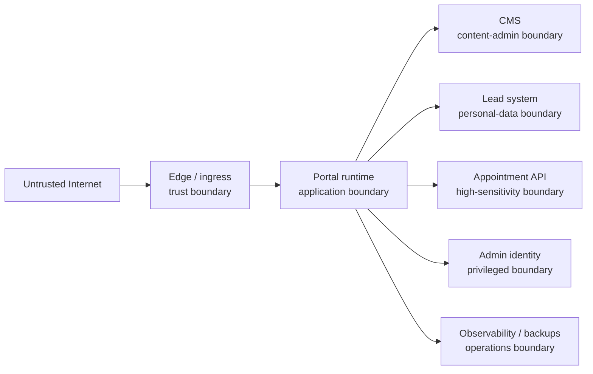

# Threat Model — Phase 0

**Method:** lightweight STRIDE analysis of critical journeys.  
**Status:** proposed risks and controls; implementation/operational effectiveness is not claimed.

## Trust boundaries

## Priority threat register

| ID   | STRIDE                               | Asset                        | Threat / attack path                                                         | Impact                                        | Observed control                                               | Gap                                                                                    | Proposed control / owner                                                                                      |
| ---- | ------------------------------------ | ---------------------------- | ---------------------------------------------------------------------------- | --------------------------------------------- | -------------------------------------------------------------- | -------------------------------------------------------------------------------------- | ------------------------------------------------------------------------------------------------------------- |
| T-01 | Tampering                            | Booking state                | Portal presents direct API `CONFIRMED` as a human-validated request          | Patient safety, false confirmation            | Existing API has explicit states, but only confirmed lifecycle | Required pending/review lifecycle absent                                               | Block integration; appointment owner + product/clinical authority accept contract                             |
| T-02 | Tampering / DoS                      | Booking capacity             | Expired DB row remains `ACTIVE` under exclusion constraint and blocks slot   | Persistent inability to book a slot           | Advisory locks and GiST exclusion constraints                  | No observed expiry transition/cleanup                                                  | Fix in appointment repository; real PostgreSQL TTL/rebook tests; appointment owner                            |
| T-03 | Spoofing                             | Admin accounts               | Credential stuffing/account takeover                                         | Content/lead/patient exposure                 | JWT, BCrypt, RBAC                                              | No MFA; login rate limit/lockout absent                                                | MFA-capable approved IdP or equivalent controls; identity owner                                               |
| T-04 | Spoofing / DoS                       | Rate limits                  | Attacker supplies forged `X-Forwarded-For`                                   | Bypass or poison rate limiting                | Redis per-IP limiter                                           | First header value trusted without proxy validation                                    | Strip at edge; use trusted proxy chain; integration tests; platform/security                                  |
| T-05 | Information disclosure               | Appointment capability token | Token appears in URL, ingress/CDN/browser history/referrer/logs              | Unauthorized view/cancel/reschedule           | Plaintext token hashed in DB; runbook warns about logs         | Redaction not implemented/evidenced                                                    | Prefer non-path exchange if contract changes; otherwise verified multi-layer redaction and no-referrer policy |
| T-06 | Information disclosure               | Patient data                 | Request/response bodies or identifiers enter logs/traces/analytics           | Health/privacy breach                         | Source comments prohibit bodies; structured logs               | Linkable UUIDs logged; no automated redaction tests; telemetry architecture incomplete | Deny-list tests, log schema, low-cardinality metrics, body capture disabled                                   |
| T-07 | Tampering                            | API client contract          | Generated client trusts wrong `PatientAddress` schema or undocumented status | Data loss, bad requests, unsafe UI state      | Runtime OpenAPI generation                                     | Schema collision; auth/errors/status missing; contract untracked                       | Unique schema names, explicit responses/security, pinned contract, diff/consumer tests                        |
| T-08 | Repudiation                          | Publishing and leads         | Admin changes content/routing without attributable approval                  | Unsafe medical/legal claims or lost leads     | Appointment audit exists for appointments                      | Portal CMS/lead audit does not exist                                                   | Author/reviewer/publisher separation and immutable audit evidence                                             |
| T-09 | DoS                                  | Appointment dependency       | Timeout/retry creates duplicate/unknown booking outcomes                     | Duplicate or lost appointment request         | Idempotency keys supported on mutations                        | No accepted adapter timeout/retry policy; concurrent same-key returns transient 409    | Same-key bounded retry, outcome-unknown UX, metrics, runbook, contract tests                                  |
| T-10 | Information disclosure               | CMS/lead forms               | Health data submitted to generic CMS/free-text form                          | Data stored by wrong processor                | Contract prohibits CMS medical forms                           | No portal/form implementation yet                                                      | Field allow-lists, no medical fallback, free-text warnings/filters, privacy review                            |
| T-11 | Elevation of privilege               | Admin APIs                   | Missing/incorrect tenant scoping exposes another organization                | Cross-tenant data exposure                    | RBAC and recent organization checks                            | Public endpoints choose first organization; no explicit tenant binding/RLS             | Pin organization at adapter/config boundary; tenancy tests; no multi-tenant claim                             |
| T-12 | Tampering / supply chain             | Production images            | Mutable/compromised dependencies or `:latest` images                         | Remote compromise, irreproducible rollback    | CodeQL, Dependabot, CI builds                                  | No SBOM/image/IaC/secret scan, signing, digest pin                                     | Add gated scans, provenance/signing as supported, digest promotion                                            |
| T-13 | Information disclosure               | Secrets                      | Environment/Kubernetes Secret exposure                                       | Full provider/database compromise             | Secret template and env injection                              | No external secret manager/rotation evidence; same repo manual manifests               | Approved secret-management ADR, least privilege, rotation and incident drill                                  |
| T-14 | DoS / information loss               | Database/backups             | VPS/cluster loss destroys DB and same-cluster backups                        | Up to total data loss beyond external records | Scheduled dumps, WAL archive, restore runbook                  | Same failure domain; no restore evidence; logical dump RPO ~24h                        | Approved off-failure-domain backup, encrypted copy, restore-tested RPO/RTO                                    |
| T-15 | Tampering                            | User input                   | XSS/injection/SSRF/file-upload abuse through CMS/forms                       | Account/data compromise                       | Framework validation in appointment API                        | Portal/CMS controls not selected; uploads undefined                                    | Output encoding, CSP, allow-list validation, URL fetch restrictions, isolated scanning if uploads approved    |
| T-16 | DoS                                  | Public forms                 | Spam and mass submissions                                                    | Operational overload/cost                     | Appointment rate limits partly implemented                     | Portal abuse controls absent; bot provider undecided                                   | Layered privacy-preserving throttling, honeypot/risk signals, monitoring, accessible recovery                 |
| T-17 | Repudiation / information disclosure | Retention                    | Data retained indefinitely or partial anonymization creates false assurance  | GDPR/legal risk                               | Disabled patient anonymization job                             | Notification recipients persist; financial/audit retention unresolved                  | Category policy and qualified review before activation; evidence-driven deletion/anonymization tests          |
| T-18 | Elevation of privilege               | CMS supply chain             | Compromised plugin/admin publishes malicious content                         | XSS, fraud, reputational harm                 | None selected                                                  | CMS/provider/plugin posture unknown                                                    | Minimal plugins, MFA/RBAC, CSP, signed webhooks, review workflow, patch SLA                                   |
| T-19 | Spoofing / tampering                 | Correlation identity         | Attacker sends huge/malformed `X-Trace-Id`                                   | Log/telemetry abuse and confusing audit       | Generated ID when absent                                       | Incoming value accepted without observed validation                                    | Validate format/length or replace at edge; preserve upstream ID separately if needed                          |
| T-20 | Information disclosure               | Non-production               | Real patient data copied to tests/demos/screenshots/AI                       | Severe privacy breach                         | Contract prohibition                                           | No portal controls/evidence yet                                                        | Synthetic data policy, DLP/secret scans, environment access controls, review checklist                        |

## Security verification required before release

- Threat-model review after actual providers and topology are selected.
- ASVS Level 2 control mapping with evidence, not checklist assertions.
- Authentication/MFA, role, organization, and publication-workflow tests.
- CSRF, XSS, injection, SSRF, redirect, CSP/header, rate-limit, and abuse tests.
- Contract compatibility and negative booking tests, including timeout, duplicate, TTL expiry, cancellation, and reschedule.
- Secret, SAST, dependency, IaC, container, SBOM, and provenance checks.
- Manual accessibility/security testing of critical forms and error recovery.
- Incident, dependency-degradation, token leakage, restore, rollback, and data-breach exercises.

## Residual-risk ownership

No residual risk is accepted by this document. Legal/privacy, clinical wording, travel-law, accounting, provider, SLO, and production-risk acceptance remain human decisions.
