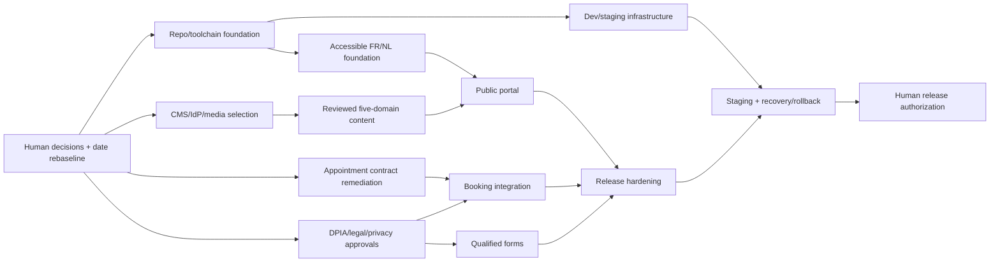

# Phase 0 Risk Register, MVP Backlog, and Feasibility

**Assessment date:** 2026-08-29  
**Release target assessed:** Monday 2026-08-31  
**Decision status:** recommendation only; no risk is accepted by the agent

## Feasibility verdict

**NO-GO for the full 31 August 2026 MVP.**

Repository evidence shows no public application implementation, no functional Git repository for the platform root, an empty infrastructure repository, no FR/NL content, no approved providers or deployment path, and critical appointment-contract defects. With two calendar days between the evidence snapshot and the target date, the Master Contract's foundation, implementation, privacy/security, accessibility, testing, staging, operations, rollback, and human acceptance gates cannot be completed safely.

This is not a statement that the product is infeasible. It is a date/scope verdict from the current observed state.

**CONDITIONAL GO for Phase 1 foundation after explicit human approval**, provided the Human Engineering Authority:

1. accepts the Phase 0 architecture direction or records changes;
2. rebaselines the public release date and/or explicitly reduces scope without weakening mandatory safety gates;
3. establishes real Git repositories/ownership boundaries;
4. assigns appointment API remediation ownership;
5. provides the minimum business/content/privacy/infrastructure decisions listed below.

## Ranked risk register

| ID   | Risk                                                                         | Likelihood                                  | Impact   | Priority | Evidence                                                              | Required treatment / owner                                                          |
| ---- | ---------------------------------------------------------------------------- | ------------------------------------------- | -------- | -------- | --------------------------------------------------------------------- | ----------------------------------------------------------------------------------- |
| R-01 | Full MVP cannot reach Definition of Done by 2026-08-31                       | Near certain                                | Critical | P0       | No public code/CI/tests; empty infra repo; two calendar days remain   | Rebaseline date/scope; Human Engineering Authority                                  |
| R-02 | Portal could falsely confirm a request before human validation               | Certain if current confirm endpoint is used | Critical | P0       | Existing API creates `CONFIRMED`; no pending/review states            | Block integration; appointment owner + product/clinical authority                   |
| R-03 | Expired holds can continue blocking overlapping bookings                     | High from static logic                      | Critical | P0       | DB constraint filters status only; no expiry transition found         | Appointment-repository fix and PostgreSQL integration test under separate authority |
| R-04 | Generated clients/forms use an incorrect address schema                      | High                                        | High     | P0       | Duplicate `PatientAddress` schema-name collision in export            | Correct schema names; pin contract; compatibility test                              |
| R-05 | OpenAPI omits auth and real responses/errors                                 | Certain                                     | High     | P0       | Empty security schemes; all operations show only 200                  | Correct/accept contract before client generation                                    |
| R-06 | Patient capability tokens leak through path logging                          | High unless edge is configured              | Critical | P0       | Token-in-path API; only manual masking guidance exists                | Verified ingress/CDN/app redaction or contract redesign                             |
| R-07 | Special-category data architecture lacks DPIA/legal basis/retention approval | Certain                                     | Critical | P0       | No approved privacy artifacts/inputs found                            | Qualified privacy/legal review before production booking                            |
| R-08 | Admin compromise due to absent MFA/login throttling                          | High for Internet exposure                  | Critical | P0       | Existing API lacks MFA; auth endpoints not rate-limited               | Approved IdP/MFA and abuse controls                                                 |
| R-09 | Deployment is non-reproducible and non-recoverable                           | Certain from repository state               | Critical | P0       | Empty infra repo; manual YAML; `:latest`; no Argo/Helm/environments   | Build approved separate GitOps/IaC path after provider decision                     |
| R-10 | Database disaster loses up to ~24h or entire same-cluster backup             | Medium                                      | Critical | P0       | Appointment quick-start logical dumps and same-cluster PVC            | Approved RPO/RTO, off-domain encrypted backup, restore drill                        |
| R-11 | FR/NL content is incomplete/unsafe or silently falls back                    | Certain currently                           | High     | P0       | No content/catalogs/owners in platform repo                           | Assign owners; complete and manually review both locales                            |
| R-12 | Generic forms collect medical or excessive personal data                     | Medium/High without governance              | Critical | P0       | Forms/models not implemented; recipients/fields/retention unknown     | Per-form purpose/allow-list and privacy review; no CMS medical forms                |
| R-13 | Accessibility critical journeys are not validated                            | Certain currently                           | High     | P0       | No portal; no browser/a11y tests or expert review                     | Accessible design system, automated and manual WCAG 2.2 AA evidence                 |
| R-14 | CMS/provider selection misses EU/workflow/exit requirements                  | Medium                                      | High     | P1       | No approved CMS/procurement evidence                                  | ADR spike and human procurement/privacy/security approval                           |
| R-15 | Lead submissions are lost or falsely acknowledged                            | Medium                                      | High     | P1       | Storage/delivery semantics undecided                                  | ADR for durability/outbox/routing/retry; failure E2E tests                          |
| R-16 | API rate limiting is bypassed via spoofed forwarding header                  | Medium/High depending edge                  | High     | P0       | First `X-Forwarded-For` trusted directly                              | Trusted proxy/edge header policy and tests                                          |
| R-17 | Telemetry retains identifiers or attacker-controlled trace content           | Medium                                      | High     | P1       | UUIDs logged; incoming trace ID unvalidated                           | Telemetry schema/redaction/validation and tests                                     |
| R-18 | Supply-chain or image vulnerability reaches production                       | Medium                                      | High     | P1       | Partial CodeQL/Dependabot only; no image/IaC/SBOM/signing gates       | CI security gates and immutable digest promotion                                    |
| R-19 | Multi-organization ambiguity routes public data incorrectly                  | Medium if second organization exists        | High     | P0       | Public API selects first organization                                 | Explicit organization binding and tenancy contract/tests                            |
| R-20 | Missing public/business inputs cause invented or unlawful publication        | Certain if implementation proceeds          | High     | P0       | Domain/contact/service area/prices/INAMI/sender/content owners absent | Human owners provide approved values; publication block until then                  |

`Likelihood` and `Impact` are Phase 0 reasoned assessments based on the cited evidence; they are not statistical measurements.

## Required unresolved inputs

### Business and content

- Approved primary domain and subdomain strategy.
- Public contact details and recipients by form type.
- Exact home-care service area.
- Approved launch services, prices, taxes, conditions, and availability.
- Approved INAMI information and placement.
- Approved travel package contents/prices/conditions and archived/current trip facts.
- Approved medical/non-medical claims, legal notices, emergency wording, and privacy/cookie texts.
- Named French and Dutch content owners/reviewers/publishers.

### Appointment integration

- Human-validation lifecycle and owning team.
- Accepted, tracked OpenAPI version and production endpoint.
- Expired-hold remediation plan.
- Explicit organization binding.
- Capability-token handling/redaction.
- Contract-change and incident/support process.

### Privacy, security, and legal

- DPIA decision and owner.
- Article 6 lawful bases and Article 9 condition.
- Retention by data category and data-subject workflows.
- Controller/processor/subprocessor and EU transfer decisions.
- Travel-law, accounting/VAT, clinical/INAMI, and accessibility expert acceptance.
- Admin identity/MFA and privileged-role model.

### Infrastructure and operations

- Actual cluster/hosting/provider context and budget.
- Registry, domain/DNS, certificates, ingress, secrets, storage, database, backups, observability, and email choices.
- Development/staging/production conventions.
- SLOs, alert ownership, support/incident process, RPO/RTO, and rollback authority.

## MVP backlog

| Order | Epic                                                | Exit evidence                                                                                                  | Dependencies                          |
| ----- | --------------------------------------------------- | -------------------------------------------------------------------------------------------------------------- | ------------------------------------- |
| 0     | Human Phase 0 decisions and release rebaseline      | Approved ADR choices/conditions and explicit Phase 1 authority                                                 | This report                           |
| 1     | Repository and toolchain foundation                 | Real Git baseline, pinned toolchains, Taskfile/CI parity, quality/security gates                               | Monorepo ADR, team/tool versions      |
| 2     | Accessible FR/NL UI and localization foundation     | Tokens/primitives, route/fallback tests, keyboard/screen-reader baseline                                       | Content owners, accessibility profile |
| 3     | Infrastructure foundation for dev/staging           | Separate infra Git repo, Helm/GitOps, secrets, immutable images, observability baseline                        | Hosting/provider/cluster ADRs         |
| 4     | CMS integration and governance                      | Accepted CMS, content models, workflow/RBAC/audit, preview/rollback, backups                                   | CMS/IdP/media ADRs, content owners    |
| 5     | Public portal and five domain presentations         | Complete reviewed FR/NL pages, SEO/performance/accessibility evidence                                          | CMS/content/localization              |
| 6     | Appointment API remediation and contract acceptance | Pending-review semantics, hold-expiry fix, corrected/pinned OpenAPI, compatibility/security tests              | Appointment owner/human decisions     |
| 7     | Home-care booking integration                       | Adapter, typed client, safe retry/error behavior, cancellation/reschedule, privacy/failure E2E                 | Epic 6, DPIA/legal/privacy acceptance |
| 8     | Qualified form platform                             | Six typed forms, approved fields/routing/retention, anti-abuse, durable delivery/admin                         | Lead/email/identity/privacy ADRs      |
| 9     | Release hardening                                   | Full CI, security scans, browser E2E, accessibility expert review, performance, legal/content/privacy sign-off | All implementation epics              |
| 10    | Staging and operational readiness                   | Representative staging acceptance, alerts/runbooks, restore and rollback exercises                             | Infrastructure + release candidate    |
| 11    | Human-authorized production release                 | Exact release-candidate approval, change plan, smoke checks, rollback criteria                                 | All gates green and accepted          |

## Critical path

The appointment contract remediation and content/privacy/provider decisions are external critical-path dependencies; adding implementation parallelism cannot remove them.

## Smallest safe scope under the current deadline

From the evidence snapshot, the only safely achievable scope by 2026-08-31 is completion and human review of Phase 0 documentation. A public holding page is not currently safe to promise because the approved domain, public contact information, FR/NL content, legal notices, infrastructure, and deployment authority are absent.

If the Human Engineering Authority later authorizes an emergency reduced release, it must be defined as a new explicit scope with its own content, accessibility, security, deployment, rollback, and legal acceptance. It must not expose appointment or qualified-form submission until their gates are satisfied.

## Recommendation

1. Record **NO-GO** for the 31 August full MVP.
2. Approve a rebaselined Phase 1 focused on engineering foundation only, after resolving repository ownership and selecting the minimum ADRs required for that phase.
3. Run appointment API remediation as separately authorized work owned by that repository; do not alter it implicitly from the portal project.
4. Reforecast the release only after Phase 1 evidence, appointment contract acceptance, content-owner commitment, and provider/infrastructure lead times are known.
